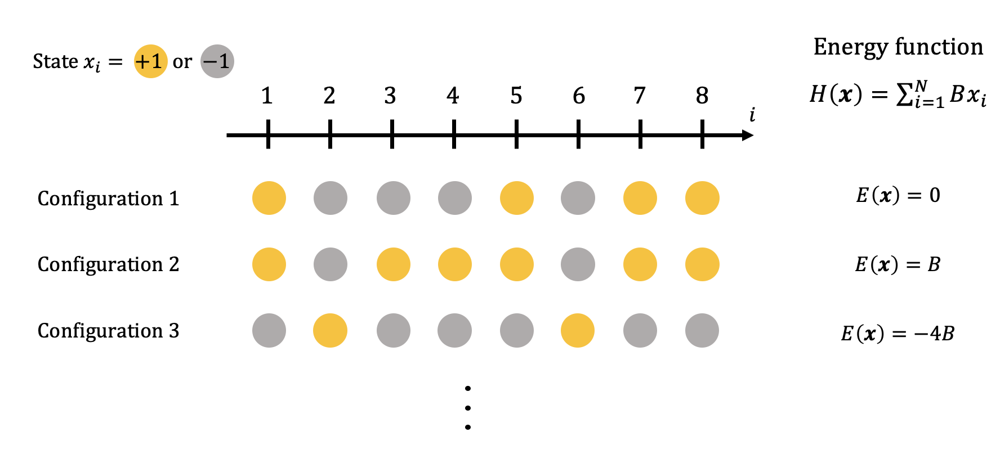
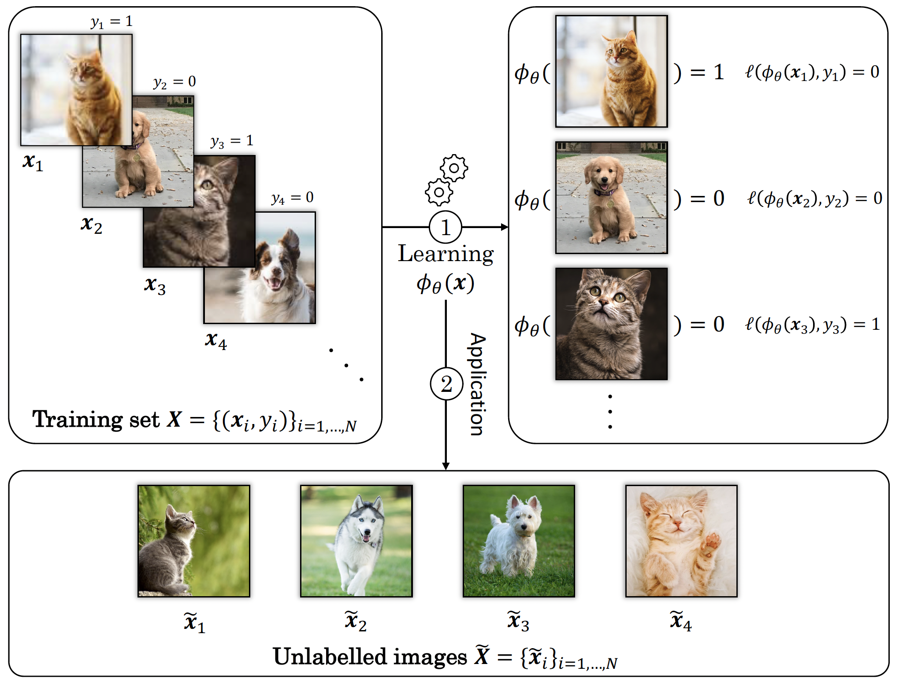

This post aims at being a non-heavy-mathematically introduction to the basics of statistical physics and the links it has with machine learning and optimisation. In an effort to make it accessible to anybody with no strong background in mathematics, a particular emphasis is being made on the explicitation of the notations and the equations across the post.
Some very nice ressources on the topics we will discuss here are available online (however in a more mathematically-involved form) such as <a href="http://www.stat.ucla.edu/~ywu/research/documents/BOOKS/MontanariInformationPhysicsComputation.pdf/">Marc Mézard and Andrea Montanari's book on information and physics</a> or <a href="https://sphinxteam.github.io/EPFLDoctoralLecture2021/">Florent Krzakala and Lenkà Zdeborova's lectures notes.</a> for more mathematically-enclined readers. 

## Statistical physics in a nutshell

Statistical physics is the branch of physics focusing on the study of the matter in different states and its various properties. Example of prime importance are gases which are made of many molecules interacting all together. The whole purpose of statistical physics is to describe how complex macroscopic behaviours, such as a change of state of the water boiling at 100°C, can emerge from these interactions. As its name suggests, statistical physics uses "statistical" (or "probabilistic") descriptions of the intereactions between several elementary components (molecules in a gas, spins in a ferromagnet, etc.) to make predictions of macroscopic behaviors, which are by essence deterministic: it does not matter how many times you try, water <i>always</i> boils at 100°C (unless you change the pressure conditions, but it has nothing to do with randomness).

### Boltzmann distribution and the partition function

 Let us consider a system made of $N$ particles and call $x_i$ the <strong>state</strong> of the $i$th particle. The state can be understood as a property of the particle such as its position, velocity, orientation or whatever else. We can then attach to this set of particles a <strong>configuration</strong> $\boldsymbol{x} = \{x\}_{i=1}^N$ which summarises all the states of the $N$ particles. The statistical description of the microscopic physical configuration $\boldsymbol{x}$ is based on an energy function, called the Hamiltonian, written $H(\boldsymbol{x})$. The probability to find the system in a given configuration $\boldsymbol{x}$ is then given by the <strong>Boltzmann distribution</strong> 

$$
p(\boldsymbol{x}) = \frac{1}{Z(\beta)} \exp(-\beta H(\boldsymbol{x})),
$$

 where $\beta$ is the inverse-temperature and $Z(\beta)$ is the <strong>partition function</strong> normalizing the probability distribution to one, i.e.

$$
Z(\beta) = \int \mathrm{d} \boldsymbol{x} \exp(-\beta H(\boldsymbol{x})).
$$

 To make these notions clearer, the diagram below sums up the several definitions introduced above on a simple example: eight particles are regularly spaced over a one-dimensional line and the state of each of them is given by either $+1$ or $-1$. There are therefore $2^8$ possible different configurations and three of them are represented on the diagram with their associated energy, given an energy function defined as $E(\boldsymbol{x}) = \sum_{i=1}^N B x_i$. Note however that this very simple example is exempt from interactions between the particles hence no interesting macroscopic behaviour can emerge and it only serves an illustrative purpose without much interest scientifically.

  

  

Taking a few time to analyse the Boltzmann distribution of states in Eq. (1) already suggests that, at fixed inverse-temperature $\beta$, low energy configurations are exponentially more probable to occur because of the minus sign in the exponential. In our simple example from the figure above, we for instance have, for $\beta = 1$ and $B=1$,

$$
p\left(\boldsymbol{x} = \{-1, -1, -1, -1, +1, -1, -1, -1\} \right) = \approx 0.05,
$$

corresponding to an energy $H(\boldsymbol{x}) = -6$ while

$$
p\left(\boldsymbol{x} = \{+1, +1, +1, -1, +1, -1, -1, -1\} \right) \approx 10^{-4},
$$

for an energy of 0. Hence the low-energy state of the first example is much more <i>probable</i> to be observed than the second one at this temperature. 

 A version of this simplistic model incorporating interactions is the <strong>1D Ising model</strong>, well-known in statistical physics and in which the $+1$ or $-1$ states corresponds to the spin of the particles and with an energy function taking additionally into account the interactions between the spins on the line, such as $E(\boldsymbol{x}) = \sum_{i=1}^N J x_{i-1} x_i$. This model exhibits a lot of interesting phenomenon from statistical physics such as a <strong>phase transition</strong>, i.e. a critical value of the temperature above which all the states are aligned. 

### The free energy and concentration phenomena

 The partition function $Z(\beta)$ is at the heart of many developments both in statistical physics and in optimisation as it contains many relevant information about the system. For instance, a quantity of particular interest is the <strong>free energy</strong> defined through the log of the partition function as

$$
F_N(\beta) = -\frac{1}{\beta} \log Z(\beta),
$$

 characterizing the available-for-work energy in the system. We can define similarly the free entropy that is $S(\beta) = -\beta F_{N}(\beta)$

In physics, we call <strong>extensive</strong> the quantities that scales linearly with the dimension $N$ of the system. This includes for instance the mass or the volume. Indeed, when a system doubles in size, its mass is also multiplied by a factor of two. This is also the case of the free energy defined just above. On the other hand, quantities that remain unchanged when varying $N$ are instead called <strong>intensive</strong> and for instance include the temperature. The intensive version of the free energy is the free energy density defined as 

$$
f(\beta) = -\frac{1}{N\beta} \log Z(\beta).
$$

 A crucial remark when studying a system subject to randomness is that the free energy is itself a function of this randomness through its dependence on the partition function. In other terms, a given value of the free energy computed as above is only valid for <i>one</i> particular realisation of the disorder. However, an important result allowing statistical physics to effectively describe deterministic behaviours based on these microscopic probabilistic descriptions is that, when $N$ is very large ($N \to \infty$ as we write mathematically), intensive thermodynamic potentials (such as the free energy density just above) actually <strong>concentrate</strong> around their average. What this means is that all realisations of the disorder will lead to values of the free energy density that are very close to its average, and closer and closer as $N$ grows.
So, basically, all we need to do when we analyse systems with large $N$ is to compute the average of the free energy $\overline{f(\beta)}$ and use it to study the behaviour of the system. This result at the heart of statistical physics is known as <strong>self-averageness</strong> (also called <strong>concentration of measure</strong> in the mathematical community). Nevertheless, computing the average of $\log Z(\beta)$ is not always an easy task to carry out analytically and some of the developments enabling to do so in complex disordered systems (known as spin glasses) led <strong>Giorgio Parisi</strong> to obtain a Nobel Prize in 2021.

## Supervised machine learning and optimisation

Without transition, let us move to machine learning, and more precisely <strong>supervised learning</strong> in one seeks to learn a statistical model that predicts a - let's say scalar to keep it simple - quantity called a label based on $M$ example vectors $\{\boldsymbol{x}_i\}_{i=1}^M$. These vectors can for instance be images of cats and dogs in which case the associated labels $y_i$ associated to each image $\boldsymbol{x}_i$ is either "cat" or "dog". The central question in supervised machine learning is then <i>Can we learn a function that predicts $y_i$ based on $\boldsymbol{x}_i$?</i> Ultimately, data scientists want to apply this model to data for which they do not know the label which is something called <strong>generalisation</strong> (new images of cats and dogs that the network never saw before). In our image classification example, we thus aim at finding a function $\phi_\theta(\boldsymbol{x}_i)$ parametrised by some values $\theta$ that can predict an estimate of $y_i$. Most of supervised machine learning problems therefore come formulated mathematically as

$$
\underset{{\boldsymbol{\theta} \in \Theta}}{\operatorname{min}} \sum_{i=1}^M \ell( \phi_{\theta}(\boldsymbol{x}_i), y_i)),
$$

where the function $\ell$ is usually called the <strong>loss (or cost) function</strong> and quantifies the error we make by replacing $y_i$ by $\boldsymbol{x}$.

The figure below provides an example of this procedure: from a set of $N$ images of dogs and cats, $\{\boldsymbol{x}_i\}_{i\in \{1,\ldots, N\}}$, together with their labels $\{y_i\}$, the data scientist builds and trains a network playing the role of the function $\phi_{\theta}(\boldsymbol{x})$. When learning, the weights $\boldsymbol{\theta}$ are optimised such that you minimise the error above, and then the data scientist applies his/her network to some new and unlabelled data for which the answer is not known yet, here the images from the set $\boldsymbol{\tilde{X}}$.

  

Let's take a moment to analyse the barbarian notations of the previous equation (7). Consider for instance a typical squared $L_2$ norm as a loss function, using the squared distance between the estimated label $\phi_\theta(\boldsymbol{x}_i)$ and the true one $y_i$ as a measure of the error,

$$
\ell( \phi_{\theta}(\boldsymbol{x}_i), y_i)) = \left|\phi_\theta(\boldsymbol{x}_i) - y_i \right|^2.
$$

In this case, Eq. (7) simply means that we are trying to identify the set of parameters $\theta$ that minimizes the sum over all examples of our loss function. Taking back our image classification problem again, the value of the loss would be zero if we correctly classify all the images. Concerning the parameters, if $\phi_\theta$ represents a neural networks, then $\theta$ refers to all the weights and bias that parametrise the network. When the estimated label $\phi_{\theta}(\boldsymbol{x}_i)$ is far away from the true one $y_i$, then the loss function is large meaning our model is not a good one while, if the two are equal, then the loss cancels out, meaning our model $\phi_\theta$ has learnt how to predict these labels perfectly.

## A bridge between statistical physics and machine learning

It turns out that the optimisation problem we define in the context of machine learning in Eq. (7) can be exactly seen as the minimisation of an energy function in statistical physics. In this analogy, the weights of our neural network are playing the role of the many particles in statistical physics and a state now corresponds to an ensemble value of these weights $\{\theta_1, \ldots, \theta_N\}$. Now we can consider the Boltzmann distribution associated to these weights that we would write 

$$
p(\theta_1, \theta_2, \cdots, \theta_N) = \frac{1}{Z} \exp\left(-\beta H(\theta_1, \theta_2, \ldots, \theta_N) \right).
$$

If we consider that the Hamiltonian is given by the loss function

$$
H(\theta_1, \theta_2, \ldots, \theta_N) = \sum_{i=1}^M |\phi_{\theta}(\boldsymbol{x}) - y_i|^2,
$$

then, we see that the free energy is

$$
\begin{align}
F_N(\beta) &= -\frac{1}{\beta} \log Z, \\\\\\
&= -\frac{1}{\beta} \log \int \mathrm{d}\boldsymbol{\theta} \exp\left(-\beta \sum_{i=1}^M |\phi_{\theta}(\boldsymbol{x}) - y_i|^2\right).
\end{align}
$$

This equation might look scary equation but let us have a look at the particular case where $\beta$ is very large (which we call the zero-temperature limit in physics). In this case, the integral is actually pretty simple because it corresponds to a summation over exponential terms scaling with a very large $\beta$. A reasonable approximation is to consider that this integral is only dominated by the minimum values of the function inside the exponential because all the other ones will be killed exponentially fast. This approximation is called <\strong>saddle-point (or Laplace) method</\strong> in physics and mathematics. Applying it here allows us to get rid of the integral and write

$$
\begin{align}
F_N(\beta) &\underset{\beta\to\infty}{\approx} -\frac{1}{\beta} \log \exp\left(-\beta \min_{\theta} \sum_{i=1}^M |\phi_{\theta}(\boldsymbol{x}) - y_i|^2\right), \\\\\\
&\underset{\beta\to\infty}{\approx} \min_{\theta} \sum_{i=1}^M |\phi_{\theta}(\boldsymbol{x}) - y_i|^2,
\end{align}
$$

which is precisely the optimisation problem associated to the supervised learning of Eq. (7)! We have hence recast the machine learning problem into a statistical physics problem with a Hamiltonian given by the loss function and that the optimisation of parameters of the network can be seen as computing the free energy of the associated system for in the zero-temperature limit. 

 
It turns out that what we did here is pretty general and can be done for several optimisation problems and machine learning models that can be reformulated as physical systems. Why is that important? Because it then means that we can use some of the tools developed by statistical physicists for centuries to study very complex problems in high-dimensions, which is exactly what computer scientists and mathematicians are dealing with in theoretical machine learning. One can therefore ask questions about the mechanisms allowing convergence in neural networks, study the topology of the landscape that we optimise over, and many more that we will explore in further posts!
 

### Glossary

Below is shown a table summarising the vocabulary from statistical physics and the corresponding terms used in the machine learning literature.

|            Machine learning            |       Statistical physics        |
| :------------------------------------: | :------------------------------: |
|             Loss function              | Energy function (or Hamiltonian) |
|             Global minima              |          Ground states           |
|               Parameters               |        Degrees of freedom        |
| Probability distribution of parameters |      Boltzmann distribution      |
|         High-dimensional limit         |       Thermodynamic limit        |

## Take-home messages

Here is a short list of important things to keep in mind after reading this post:

- 
Statiscal physics uses <strong>probabilistic descriptions</strong> to model the microscopic interactions between particles,

- 
Deterministic behaviours can be inferred from probabilistic modellings thanks to <strong>self-averageness</strong> of intensive thermodynamic potentials,

- 
In machine learning or optimization, we can phrase a lot of problems in a statistical physics setup and use the tools that were developed by physicists for centuries to study it, 

This post serves as a beginner-friendly introduction to some ideas from physics and how they link, in a general manner, to some concepts in machine learning and optimisation. Building upon this basis, we will see in further posts how to use this powerfull bridge to analyse some machine learning systems in a theoretical physics framework.

